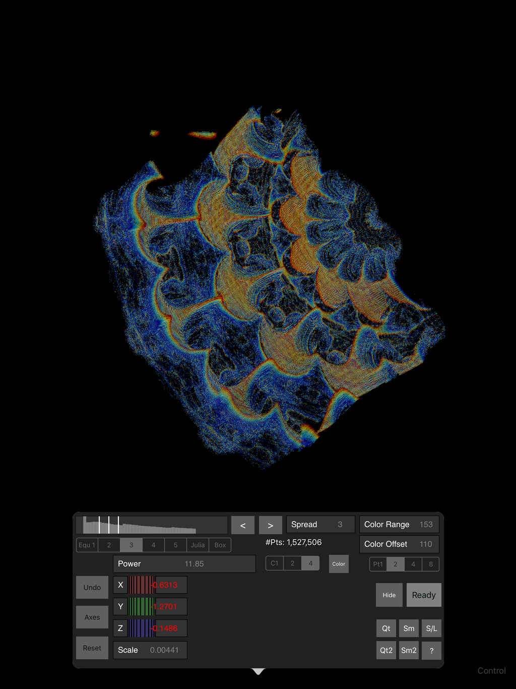

# MandelBulbQuad
MandelBulb rendered as a Point Cloud for IOS, uses Swift and Metal

Work in progress.
Calculates various MandelBulb equations as a 288x288x288 Point Cloud,
and allows you specify which portions are rendered, and how they are colored.

Swift 4 uses Metal for compute shaders and 3D rendering shader.

Also has MandelBox amd stacked Julia sets modes.

Need help: Why does a Release build quit running immediately from XCode, even though the app runs fine
on the iPad when you run it directly?

